# Pipeline de Renderizado — Análisis Profundo

Especificación técnica de cómo Pick Components renderiza, parsea expresiones,
resuelve bindings y gestiona la reactividad. Cubre la ruta completa desde el
decorador `@PickRender` hasta las actualizaciones del DOM en vivo.

---

## Tabla de Contenidos

1. [Visión General de la Arquitectura](#1-visión-general-de-la-arquitectura)
2. [Registro de Componentes](#2-registro-de-componentes)
3. [Pipeline de Renderizado](#3-pipeline-de-renderizado)
4. [Sistema de Templates](#4-sistema-de-templates)
5. [Parser de Expresiones](#5-parser-de-expresiones)
6. [Resolución de Bindings](#6-resolución-de-bindings)
7. [Sistema de Reactividad](#7-sistema-de-reactividad)
8. [Modelo de Seguridad](#8-modelo-de-seguridad)
9. [Ciclo de Vida del Componente](#9-ciclo-de-vida-del-componente)

---

## 1. Visión General de la Arquitectura

El sistema de renderizado transforma una clase TypeScript decorada en un
custom element con bindings reactivos al DOM. El pipeline es determinístico
y sin estado por invocación — no hay estado mutable global fuera del
service registry a nivel de framework.

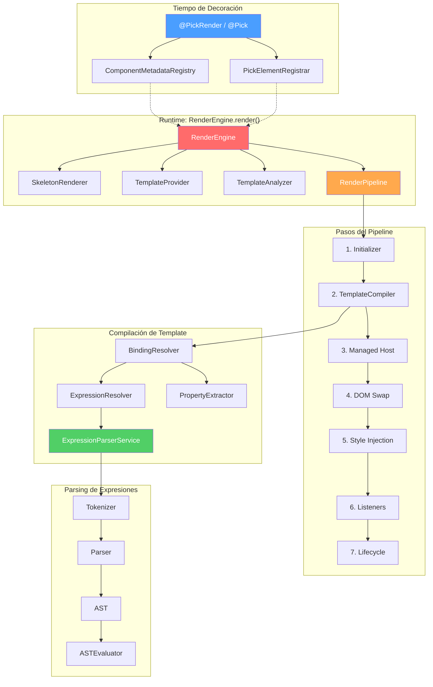

---

## 2. Registro de Componentes

### Flujo en Tiempo de Decoración

Cuando una clase es decorada con `@PickRender` (o `@Pick`, que lo envuelve),
ocurren dos cosas en el momento de evaluación del módulo:

1. **Registro de metadatos** — La configuración del componente (selector,
   template, constants, rules, skeleton, initializer factory, lifecycle factory)
   se almacena en `ComponentMetadataRegistry`.
2. **Registro de custom element** — El selector se registra como custom element
   via `PickElementRegistrar`, vinculando el nombre de tag con la clase del
   componente.

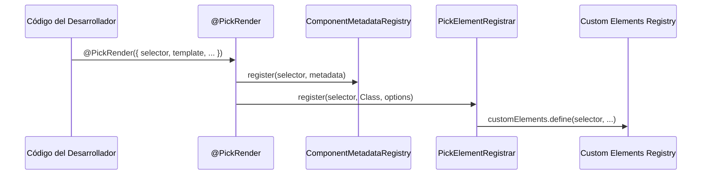

### @Pick vs @PickRender

`@Pick` es un decorador de nivel superior que proporciona una API de
configuración inline. Internamente:

1. Captura la configuración via `PickComponentFactory.captureConfig(setup)`
2. Crea una clase mejorada con accessors reactivos para cada propiedad de estado
3. Crea clases `Initializer` y `Lifecycle` a partir de los hooks del setup
4. Delega a `@PickRender` con la configuración generada

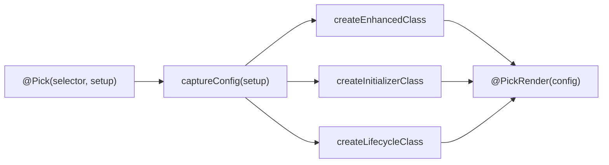

---

## 3. Pipeline de Renderizado

Cuando el navegador encuentra un custom element registrado,
`RenderEngine.render()` es invocado. Esta es la secuencia completa:

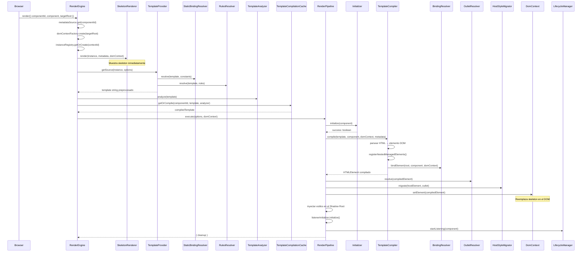

### Resumen de Pasos del Pipeline

| Paso                | Responsabilidad                                                         | Artefacto                                  |
| ------------------- | ----------------------------------------------------------------------- | ------------------------------------------ |
| 1. Initializer      | Setup asíncrono (fetch data, configurar estado)                         | `boolean` — continuar o mostrar error      |
| 2. Template Compile | HTML → DOM + wiring de bindings reactivos                               | `HTMLElement` con suscripciones activas    |
| 3. Managed Host     | Resolver outlet, migrar class/id del host                               | Elemento compilado con estilos             |
| 4. DOM Swap         | Reemplazar skeleton con elemento compilado                              | Componente visible                         |
| 5. Style Injection  | Insertar `<style>` en el Shadow Root si `metadata.styles` está definido | Estilos del componente activos             |
| 6. Listeners        | Conectar event handlers de `@Listen`                                    | Event listeners activos                    |
| 7. Lifecycle        | Iniciar `LifecycleManager.startListening()`                             | Suscripciones de lógica de negocio activas |

---

## 4. Sistema de Templates

### 4.1. Preprocesamiento de Templates

Antes de la compilación reactiva, el template pasa por dos fases de resolución
estática. Se ejecutan una vez y el resultado se cachea.

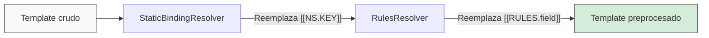

**Constantes estáticas** — Los tokens `[[Namespace.Key]]` se reemplazan con
valores literales de la configuración `constants` del componente:

```
Template:   <div class="[[Theme.BADGE]]">text</div>
Constants:  { Theme: { BADGE: 'badge primary' } }
Resultado:  <div class="badge primary">text</div>
```

**Reglas de validación** — Los tokens `[[RULES.fieldName]]` se expanden a
atributos de validación HTML5 desde la configuración `rules` del componente:

```
Template:   <input [[RULES.email]] />
Rules:      { email: { required: true, minlength: 3 } }
Resultado:  <input required minlength="3" />
```

### 4.2. Compilación de Templates

`TemplateCompiler.compile()` transforma el template preprocesado en un
elemento DOM vivo con bindings reactivos conectados.

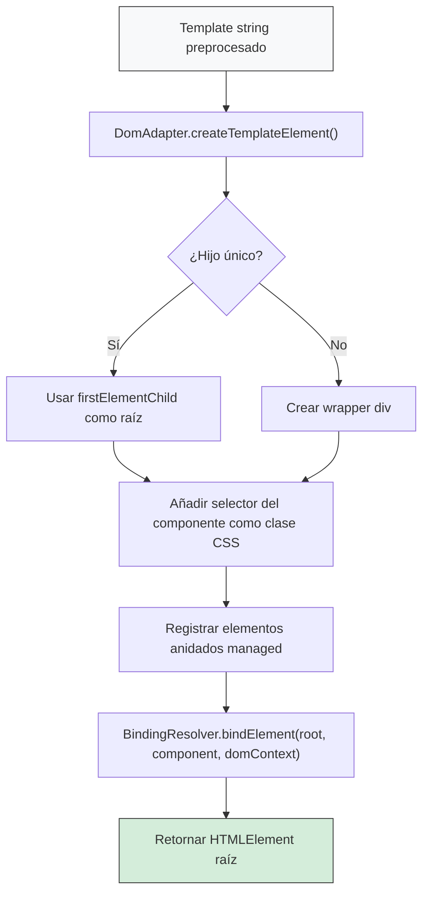

### 4.3. Proyección de contenido (slots nativos)

Pick Components usa Shadow DOM y elementos `<slot>` nativos para la proyección de contenido. No se requiere código extra del framework — el navegador gestiona la asignación de nodos de forma nativa.

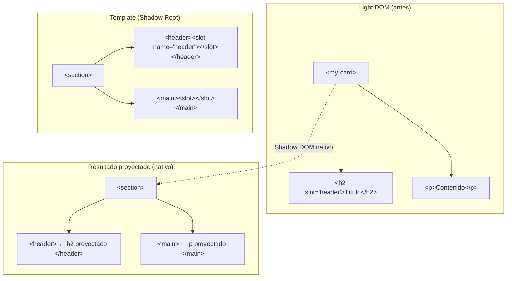

**Reglas de proyección:**

| Tipo de Slot                 | Regla de Coincidencia                       | Fallback                       |
| ---------------------------- | ------------------------------------------- | ------------------------------ |
| Nombrado (`<slot name="X">`) | Hijos del Light DOM con atributo `slot="X"` | Contenido interno del `<slot>` |
| Por defecto (`<slot>`)       | Hijos del Light DOM sin atributo `slot`     | Contenido interno del `<slot>` |

### 4.4. Análisis de Templates

`TemplateAnalyzer` escanea el template preprocesado buscando tokens
`{{expression}}` usando un tokenizer consciente de HTML. Solo extrae bindings
de contextos seguros (nodos de texto y valores de atributos), ignorando
nombres de tags, nombres de atributos y contenido script/style.

El resultado del análisis es un `CompiledTemplate` que contiene el template
string y un `Set<string>` con todas las expresiones de binding.

---

## 5. Parser de Expresiones

El parser de expresiones es un pipeline de tres etapas que convierte
expresiones de template como `user.name.toUpperCase()` en valores evaluados.

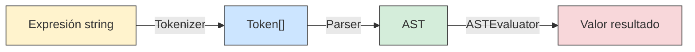

### 5.1. Tokenizer

`Tokenizer` realiza el análisis léxico — un escaneo lineal que convierte un
string de expresión en una secuencia de tokens tipados.

**Tipos de token (25):**

| Categoría   | Tokens                                                         |
| ----------- | -------------------------------------------------------------- |
| Valores     | `IDENTIFIER`, `NUMBER`, `STRING`                               |
| Aritmética  | `PLUS`, `MINUS`, `MULTIPLY`, `DIVIDE`, `MODULO`                |
| Comparación | `EQUAL` (`===`), `NOT_EQUAL` (`!==`), `GT`, `LT`, `GTE`, `LTE` |
| Lógicos     | `AND` (`&&`), `OR` (`\|\|`), `NOT` (`!`)                       |
| Acceso      | `DOT` (`.`), `OPTIONAL_CHAIN` (`?.`)                           |
| Agrupación  | `LPAREN`, `RPAREN`, `COMMA`                                    |
| Condicional | `QUESTION` (`?`), `COLON` (`:`)                                |
| Terminus    | `EOF`                                                          |

**Algoritmo de escaneo:**

1. Saltar espacios en blanco
2. Verificar operadores de 3 caracteres primero (`===`, `!==`)
3. Verificar operadores de 2 caracteres (`?.`, `>=`, `<=`, `&&`, `||`)
4. Coincidir tokens de un carácter via switch
5. Leer identificadores (`/[a-zA-Z_$][a-zA-Z0-9_$]*/`)
6. Leer números (`/[0-9.]+/`)
7. Leer strings (comillas simples o dobles, con secuencias de escape)
8. Añadir `EOF`

**Ejemplo:**

```
Input:  "user.name + 'suffix'"
Output: [IDENT(user), DOT, IDENT(name), PLUS, STRING(suffix), EOF]
```

### 5.2. Parser

`Parser` es un parser de descenso recursivo que convierte tokens en un
Abstract Syntax Tree (AST). Cada regla gramatical corresponde a un método,
y la precedencia de operadores está codificada en la jerarquía de llamadas.

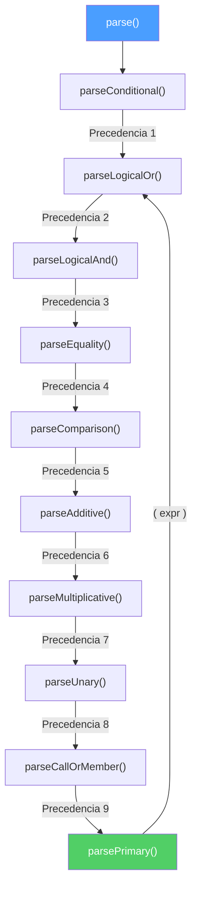

**Tabla de precedencia de operadores (menor → mayor):**

| Nivel | Método                | Operadores                           | Asociatividad |
| ----- | --------------------- | ------------------------------------ | ------------- |
| 1     | `parseConditional`    | `? :`                                | Derecha       |
| 2     | `parseLogicalOr`      | `\|\|`                               | Izquierda     |
| 3     | `parseLogicalAnd`     | `&&`                                 | Izquierda     |
| 4     | `parseEquality`       | `===`, `!==`                         | Izquierda     |
| 5     | `parseComparison`     | `>`, `<`, `>=`, `<=`                 | Izquierda     |
| 6     | `parseAdditive`       | `+`, `-`                             | Izquierda     |
| 7     | `parseMultiplicative` | `*`, `/`, `%`                        | Izquierda     |
| 8     | `parseUnary`          | `!`, `-`, `+` (prefijo)              | Derecha       |
| 9     | `parseCallOrMember`   | `.`, `?.`, `()`                      | Izquierda     |
| 10    | `parsePrimary`        | literales, identificadores, `(expr)` | —             |

**Protección de profundidad:** El parser rastrea la profundidad de anidamiento
en expresiones entre paréntesis y cadenas de ternarios. Si la profundidad
excede `MAX_DEPTH` (32), lanza
`Expression nesting depth exceeds maximum of 32`.

### 5.3. Tipos de Nodo AST

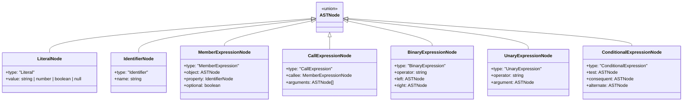

**Ejemplo de parsing:**

```
Expresión: "a + b * 2"

AST:
  BinaryExpression(+)
  ├── Identifier(a)
  └── BinaryExpression(*)
      ├── Identifier(b)
      └── Literal(2)
```

La multiplicación tiene mayor precedencia que la suma porque `parseAdditive`
llama a `parseMultiplicative` primero, que resuelve completamente `b * 2`
antes de retornar al nivel aditivo.

### 5.4. ASTEvaluator (Patrón Strategy)

`ASTEvaluator` despacha la evaluación a estrategias específicas por tipo de
nodo. Cada estrategia implementa `INodeEvaluatorStrategy` y maneja un tipo
de nodo AST.

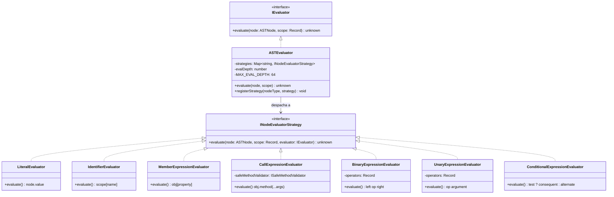

**Comportamiento de evaluación por estrategia:**

| Estrategia                       | Entrada                            | Salida                                                                                  |
| -------------------------------- | ---------------------------------- | --------------------------------------------------------------------------------------- |
| `LiteralEvaluator`               | `Literal(42)`                      | `42`                                                                                    |
| `IdentifierEvaluator`            | `Identifier("x")` + scope `{x: 5}` | `5`                                                                                     |
| `MemberExpressionEvaluator`      | `obj.prop`                         | `obj[prop]`, con soporte `?.`                                                           |
| `CallExpressionEvaluator`        | `str.toUpperCase()`                | Valida contra `SafeMethodValidator`, luego invoca                                       |
| `BinaryExpressionEvaluator`      | `3 + 4`                            | `7` — soporta `+`, `-`, `*`, `/`, `%`, `===`, `!==`, `>`, `<`, `>=`, `<=`, `&&`, `\|\|` |
| `UnaryExpressionEvaluator`       | `!true`                            | `false` — soporta `!`, `-`, `+`                                                         |
| `ConditionalExpressionEvaluator` | `x ? a : b`                        | Evalúa `test`, luego `consequent` o `alternate` (cortocircuito)                         |

**Protección de profundidad:** `ASTEvaluator` rastrea la profundidad de
evaluación. Si excede `MAX_EVAL_DEPTH` (64), lanza
`Expression evaluation depth exceeds maximum of 64`.

### 5.5. ExpressionParserService (Orquestador)

`ExpressionParserService` coordina todo el pipeline y añade dos
funcionalidades: **caché** y **extracción de dependencias**.

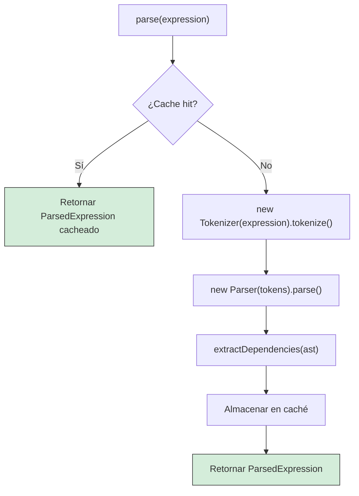

**Extracción de dependencias** — recorre el AST en profundidad y recolecta
los identificadores raíz:

```
Expresión: "user.name + getAge(items)"
Recorrido del AST:
  BinaryExpression(+)
  ├── MemberExpression → object es Identifier("user") → añadir "user"
  └── CallExpression
      ├── callee: Identifier("getAge") → añadir "getAge"
      └── args[0]: Identifier("items") → añadir "items"

Dependencias: ["user", "getAge", "items"]
```

### 5.6. Traza Completa de Parsing

Traza de extremo a extremo para `user.name.toUpperCase() + ' is ' + (age > 18 ? 'adult' : 'minor')`:

```mermaid
flowchart TD
    subgraph "1. Tokenización"
        T1["IDENT(user)"] --> T2["DOT"]
        T2 --> T3["IDENT(name)"]
        T3 --> T4["DOT"]
        T4 --> T5["IDENT(toUpperCase)"]
        T5 --> T6["LPAREN"]
        T6 --> T7["RPAREN"]
        T7 --> T8["PLUS"]
        T8 --> T9["STRING(' is ')"]
        T9 --> T10["PLUS"]
        T10 --> T11["LPAREN"]
        T11 --> T12["IDENT(age)"]
        T12 --> T13["GT"]
        T13 --> T14["NUMBER(18)"]
        T14 --> T15["QUESTION"]
        T15 --> T16["STRING('adult')"]
        T16 --> T17["COLON"]
        T17 --> T18["STRING('minor')"]
        T18 --> T19["RPAREN"]
        T19 --> T20["EOF"]
    end

    subgraph "2. AST"
        AST1["BinaryExpression(+)"]
        AST1 --> AST2["BinaryExpression(+)"]
        AST1 --> AST3["ConditionalExpression"]
        AST2 --> AST4["CallExpression"]
        AST2 --> AST5["Literal(' is ')"]
        AST4 --> AST6["MemberExpression(toUpperCase)"]
        AST6 --> AST7["MemberExpression(name)"]
        AST7 --> AST8["Identifier(user)"]
        AST3 --> AST9["BinaryExpression(>)"]
        AST3 --> AST10["Literal('adult')"]
        AST3 --> AST11["Literal('minor')"]
        AST9 --> AST12["Identifier(age)"]
        AST9 --> AST13["Literal(18)"]
    end

    subgraph "3. Evaluación"
        E1["scope = { user: { name: 'alice' }, age: 25 }"]
        E2["user.name → 'alice'"]
        E3["'alice'.toUpperCase() → 'ALICE' ✓ SafeMethodValidator"]
        E4["'ALICE' + ' is ' → 'ALICE is '"]
        E5["25 > 18 → true"]
        E6["true ? 'adult' : 'minor' → 'adult'"]
        E7["'ALICE is ' + 'adult' → 'ALICE is adult'"]
    end
```

---

## 6. Resolución de Bindings

### 6.1. BindingResolver

`BindingResolver` es el puente entre el DOM compilado y el sistema de
reactividad. Recorre el árbol DOM, identifica tokens `{{expression}}` en
valores de atributos y nodos de texto, extrae dependencias de propiedades,
y se suscribe a los observables reactivos.

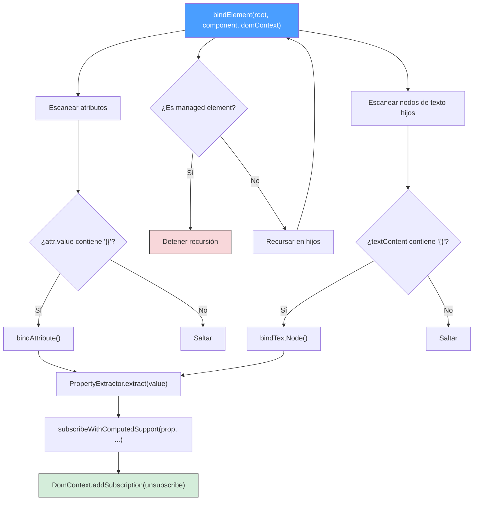

### 6.2. Binding de Atributos

Para cada atributo que contiene `{{...}}`:

1. **Extraer dependencias** via `PropertyExtractor`
2. **Crear callback de actualización** que re-evalúa la expresión y establece
   el valor del atributo
3. **Ejecutar inmediatamente** para establecer el valor inicial
4. **Suscribir** al observable de cada dependencia

**Optimización para objetos:** Si el binding es un simple `{{prop}}` que apunta
a un objeto o array, el valor se almacena en `ObjectRegistry` y el atributo
recibe un ID de referencia en vez de `[object Object]`.

### 6.3. Binding de Nodos de Texto

Mismo patrón que atributos, pero actualiza `node.textContent` en vez de
`attr.value`.

### 6.4. Soporte para Getters Computados

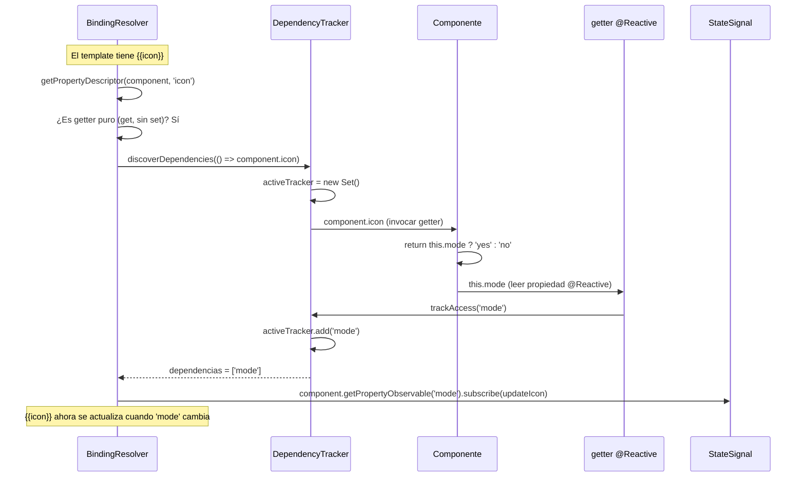

Este mecanismo permite que los getters computados participen en la reactividad
sin requerir declaraciones explícitas de dependencias. El interceptor getter
del decorador `@Reactive` llama a `DependencyTracker.trackAccess()`, que
registra el acceso a la propiedad solo cuando hay un contexto de tracking activo.

---

## 7. Sistema de Reactividad

### 7.1. Arquitectura

El sistema de reactividad está basado en señales con granularidad por
propiedad. No hay proxies profundos ni diffs de virtual DOM — cada propiedad
`@Reactive` tiene su propio canal `StateSignal`, y solo los suscriptores
de esa propiedad específica son notificados al cambiar.

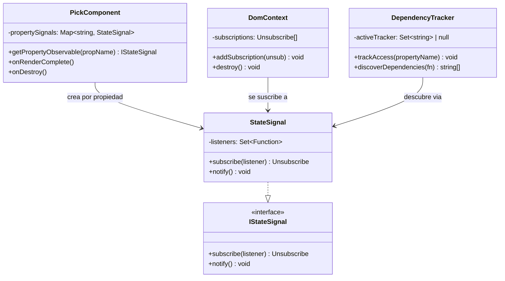

### 7.2. Ciclo de Actualización Reactiva

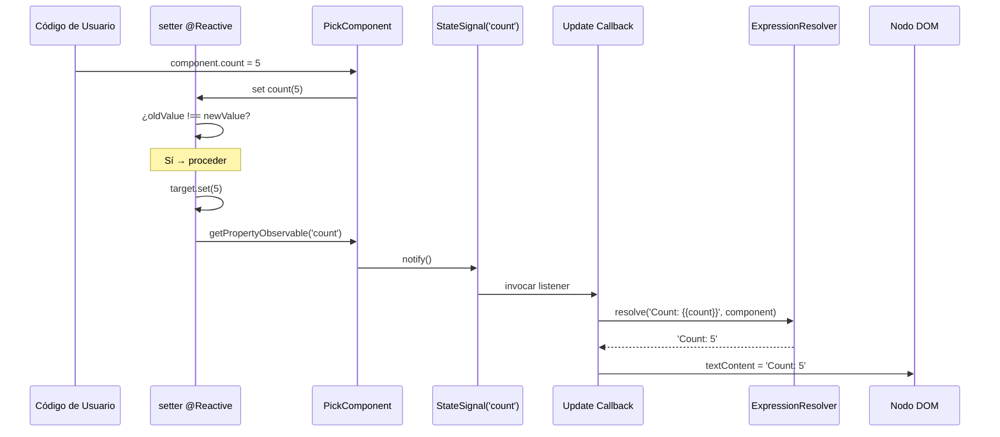

### 7.3. Internos del Decorador @Reactive

El decorador `@Reactive` soporta decoradores estándar de TypeScript 5.0+ y el
pipeline `experimentalDecorators`:

Requisito de tooling:

- Emit aceptado: decoradores estándar TC39 o `experimentalDecorators`.
- Sintaxis de estado recomendada: `@Reactive count = 0`.
- Sintaxis opcional: `@Reactive accessor count = 0` sigue soportado para usuarios de auto-accessors TC39.
- Modo por defecto del framework: `bootstrapFramework(Services)` acepta ambos sistemas de decoradores.
- Modo estricto opt-in: `bootstrapFramework(Services, {}, { decorators: "strict" })` rechaza llamadas `experimentalDecorators`.

El playground y los ejemplos descargados transpilan con
`experimentalDecorators: false`, pero los proyectos consumidores no tienen que
copiar esa configuración. Si un proyecto Vite/TypeScript ya usa
`experimentalDecorators`, el modo `auto` por defecto mantiene
`@Reactive count = 0` funcionando
sin exigir cambios de `tsconfig`.

**Intercepción getter:**

1. Llama a `DependencyTracker.trackAccess(propertyName)` — registra el acceso
   si hay un descubrimiento de getter computado en progreso (no-op en caso
   contrario)
2. Retorna el valor respaldado via `target.get.call(this)`

**Intercepción setter:**

1. Lee el valor anterior via `target.get.call(this)`
2. Si `oldValue !== newValue`:
   - Almacena el nuevo valor via `target.set.call(this, value)`
   - Llama a `this.getPropertyObservable(propertyName).notify()` — dispara
     todos los callbacks de actualización DOM suscritos

### 7.4. StateSignal

Implementación observable mínima:

- `subscribe(listener)` — añade función a un `Set`, retorna una función
  de desuscripción que la elimina
- `notify()` — itera una copia snapshot de los listeners, llamando a cada uno.
  Las excepciones se aíslan por listener para que un suscriptor defectuoso
  no rompa la cadena de notificación.

### 7.5. Ciclo de Vida de Suscripciones

Todas las suscripciones creadas durante el binding se almacenan en `DomContext`
via `addSubscription(unsubscribe)`. Cuando se llama a `DomContext.destroy()`:

1. Todas las funciones de desuscripción se ejecutan (listeners eliminados de
   `StateSignal`)
2. El elemento DOM se elimina del padre
3. El contexto se libera de `ComponentInstanceRegistry`

Esto garantiza cero fugas de suscripciones.

---

## 8. Modelo de Seguridad

### 8.1. Whitelist de Métodos Seguros

`CallExpressionEvaluator` valida cada llamada a método contra
`SafeMethodValidator` antes de invocar. Solo los métodos explícitamente
incluidos en la whitelist están permitidos.

| Tipo     | Métodos Permitidos                                                                                                                                                                                                                                          |
| -------- | ----------------------------------------------------------------------------------------------------------------------------------------------------------------------------------------------------------------------------------------------------------- |
| `string` | `charAt`, `charCodeAt`, `concat`, `endsWith`, `includes`, `indexOf`, `lastIndexOf`, `match`, `padEnd`, `padStart`, `repeat`, `replace`, `search`, `slice`, `split`, `startsWith`, `substring`, `toLowerCase`, `toUpperCase`, `trim`, `trimEnd`, `trimStart` |
| `number` | `toExponential`, `toFixed`, `toLocaleString`, `toPrecision`, `toString`, `valueOf`                                                                                                                                                                          |
| `Array`  | `join`, `concat`, `slice`, `indexOf`, `lastIndexOf`, `includes`, `toString`, `toLocaleString`                                                                                                                                                               |
| `Date`   | `getDate`, `getDay`, `getFullYear`, `getHours`, `getMilliseconds`, `getMinutes`, `getMonth`, `getSeconds`, `getTime`, `toDateString`, `toISOString`, `toJSON`, `toLocaleDateString`, `toLocaleString`, `toLocaleTimeString`, `toString`, `toTimeString`     |
| `object` | `toString`, `valueOf`                                                                                                                                                                                                                                       |

Todos los métodos de la whitelist son **de solo lectura** — no se permiten
métodos mutantes como `push`, `splice`, `setDate`, etc.

### 8.2. Límites de Profundidad de Recursión

| Componente                                 | Límite | Error                                               |
| ------------------------------------------ | ------ | --------------------------------------------------- |
| `Parser` (parseConditional + parsePrimary) | 32     | `Expression nesting depth exceeds maximum of 32`    |
| `ASTEvaluator` (evaluate)                  | 64     | `Expression evaluation depth exceeds maximum of 64` |

El límite del evaluador es mayor que el del parser porque las cadenas de
acceso a miembros como `a.b.c.d.e` crean nodos `MemberExpression` anidados
que recursan durante la evaluación, aunque no incrementan la profundidad de
anidamiento del parser.

### 8.3. Decisiones de Diseño

- **Sin `eval` / `new Function`** — Todo el pipeline es determinístico:
  tokenización → parsing → AST → despacho por estrategia. No hay generación
  dinámica de código.
- **Solo igualdad estricta** — El parser soporta `===` y `!==` pero no `==`
  ni `!=`, previniendo sorpresas de coerción de tipos.
- **Escaneo de templates consciente de HTML** — `TemplateAnalyzer` usa un
  escáner autocontenido de fragmentos HTML para extraer bindings solo de
  contextos seguros (texto y valores de atributos), nunca de nombres de tags o
  atributos de event handlers.

---

## 9. Ciclo de Vida del Componente

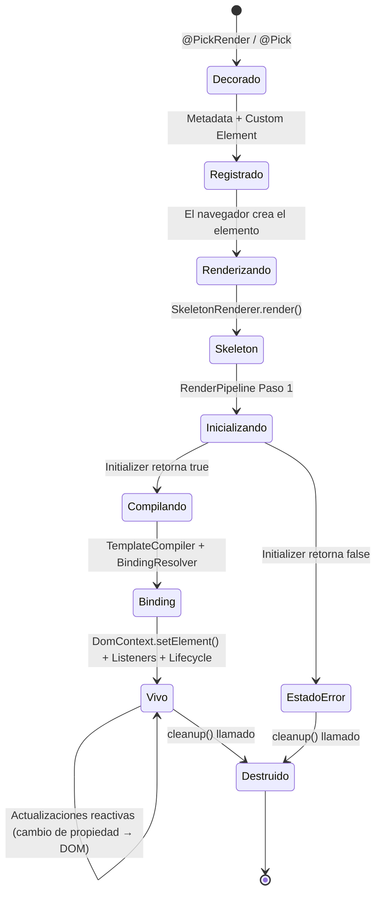

### Hooks del Ciclo de Vida

| Fase        | Quién                       | Método                          | Propósito                                        |
| ----------- | --------------------------- | ------------------------------- | ------------------------------------------------ |
| Pre-render  | `PickInitializer` | `onInitialize(component)`       | Setup asíncrono (fetch data, configurar estado)  |
| Post-render | `PickComponent`            | `onRenderComplete()`            | DOM disponible, puede consultar elementos        |
| Post-render | `PickLifecycleManager`     | `onComponentReady(component)`   | Conectar suscripciones a servicios, event bus    |
| Destroy     | `PickLifecycleManager`     | `onComponentDestroy(component)` | Cleanup de lógica de negocio                     |
| Destroy     | `PickComponent`            | `onDestroy()`                   | Emite señal `destroyed$`                         |
| Destroy     | `DomContext`                | `destroy()`                     | Ejecutar todas las desuscripciones, eliminar DOM |

### Patrón de Suscripciones del LifecycleManager

`PickLifecycleManager.addSubscription()` registra funciones de teardown que
se ejecutan automáticamente cuando se llama `stopListening()`. Esto previene
fugas de suscripciones en la lógica de negocio:

```typescript
protected onComponentReady(component: MyComponent): void {
  // Suscribirse a servicio → actualizar estado del componente
  this.addSubscription(
    dataService.onUpdate$.subscribe(data => {
      component.items = data;  // @Reactive dispara actualización del DOM
    })
  );
}
```

---

## Resumen de Patrones de Diseño

| Patrón    | Dónde                                                                              | Propósito                                                        |
| --------- | ---------------------------------------------------------------------------------- | ---------------------------------------------------------------- |
| Strategy  | `ASTEvaluator` → `INodeEvaluatorStrategy`                                          | Evaluación extensible sin modificar el evaluador                 |
| Observer  | `StateSignal` → callbacks suscriptores                                             | Notificaciones de cambio de propiedades reactivas                |
| Factory   | `initializer: () => new Init(deps)`                                                | DI explícito para colaboradores del lifecycle                    |
| Pipeline  | `RenderPipeline` secuencia de 7 pasos                                              | Fases de renderizado ordenadas y componibles                     |
| Registry  | `ComponentMetadataRegistry`, `ComponentInstanceRegistry`, `ManagedElementRegistry` | Lookup desacoplado y gestión del lifecycle                       |
| Composite | `DomContext.subscriptions[]`                                                       | Punto central de cleanup para todos los teardowns                |
| Facade    | `RenderEngine`                                                                     | Punto de entrada único que oculta la complejidad del renderizado |
| Decorator | `@Reactive`, `@PickRender`, `@Pick`, `@Listen`                                   | Adjunción declarativa de metadata y comportamiento               |
| WeakMap   | `ManagedElementRegistry`                                                           | Asociaciones elemento/instancia amigables con el GC              |
