# Rendering Pipeline — Deep Dive

Technical specification of how Pick Components renders, parses expressions,
resolves bindings, and manages reactivity. Covers the full path from
`@PickRender` decorator to live DOM updates.

---

## Table of Contents

1. [Architecture Overview](#1-architecture-overview)
2. [Component Registration](#2-component-registration)
3. [Rendering Pipeline](#3-rendering-pipeline)
4. [Template System](#4-template-system)
5. [Expression Parser](#5-expression-parser)
6. [Binding Resolution](#6-binding-resolution)
7. [Reactivity System](#7-reactivity-system)
8. [Security Model](#8-security-model)
9. [Component Lifecycle](#9-component-lifecycle)

---

## 1. Architecture Overview

The rendering system transforms a decorated TypeScript class into a live
custom element with reactive DOM bindings. The pipeline is deterministic
and stateless per invocation — no global mutable state outside the
framework-level service registry.

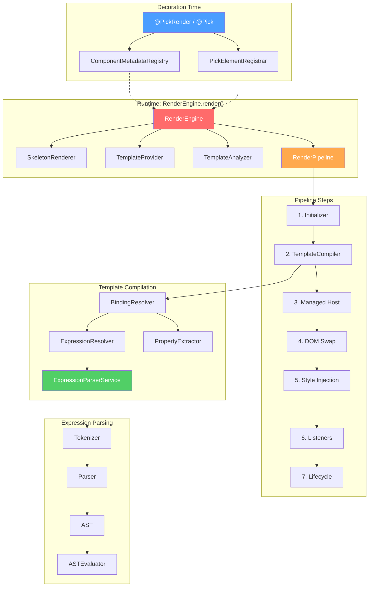

---

## 2. Component Registration

### Decorator-Time Flow

When a class is decorated with `@PickRender` (or `@Pick`, which wraps it),
two things happen at module evaluation time:

1. **Metadata registration** — Component configuration (selector, template,
   constants, rules, skeleton, initializer factory, lifecycle factory) is
   stored in `ComponentMetadataRegistry`.
2. **Custom element registration** — The selector is registered as a
   custom element via `PickElementRegistrar`, linking the tag name to the
   component class.

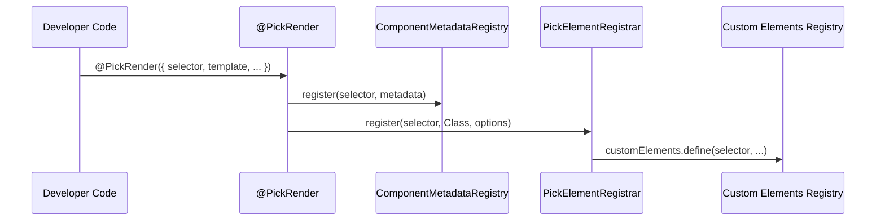

### @Pick vs @PickRender

`@Pick` is a higher-level decorator that provides an inline setup API.
Internally it:

1. Captures configuration via `PickComponentFactory.captureConfig(setup)`
2. Creates an enhanced class with reactive accessors for each state property
3. Creates `Initializer` and `Lifecycle` classes from setup hooks
4. Delegates to `@PickRender` with the generated configuration

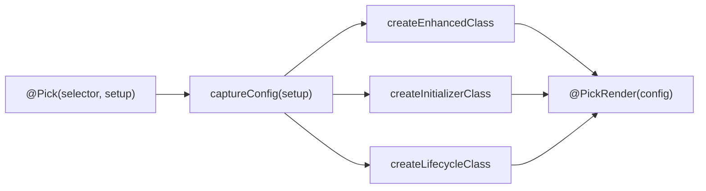

---

## 3. Rendering Pipeline

When the browser encounters a registered custom element, `RenderEngine.render()`
is called. This is the full sequence:

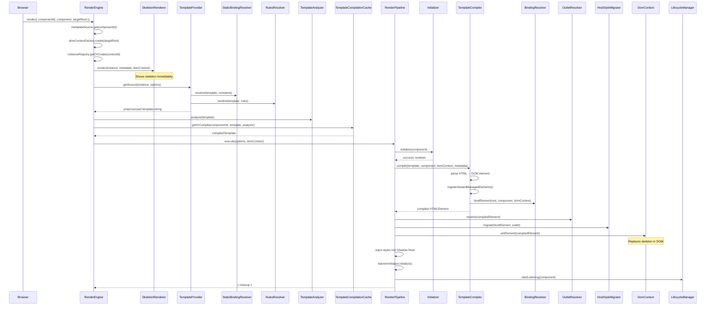

### Pipeline Steps Summary

| Step                | Responsibility                                                 | Artifact                              |
| ------------------- | -------------------------------------------------------------- | ------------------------------------- |
| 1. Initializer      | Async setup (fetch data, configure state)                      | `boolean` — proceed or show error     |
| 2. Template Compile | HTML → DOM + reactive binding wiring                           | `HTMLElement` with live subscriptions |
| 3. Managed Host     | Resolve outlet, migrate class/id from host                     | Styled compiled element               |
| 4. DOM Swap         | Replace skeleton with compiled element                         | Visible component                     |
| 5. Style Injection  | Prepend `<style>` into Shadow Root if `metadata.styles` is set | Scoped component styles active        |
| 6. Listeners        | Wire `@Listen` decorator event handlers                        | Active event listeners                |
| 7. Lifecycle        | Start `LifecycleManager.startListening()`                      | Running business logic subscriptions  |

---

## 4. Template System

### 4.1. Template Preprocessing

Before reactive compilation, the template goes through two static resolution
phases. These run once and the result is cached.

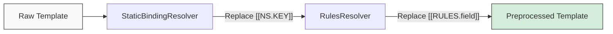

**Static Constants** — `[[Namespace.Key]]` tokens are replaced with literal values
from the component's `constants` configuration:

```
Template:  <div class="[[Theme.BADGE]]">text</div>
Constants: { Theme: { BADGE: 'badge primary' } }
Result:    <div class="badge primary">text</div>
```

**Validation Rules** — `[[RULES.fieldName]]` tokens are expanded to HTML5
validation attributes from the component's `rules` configuration:

```
Template:  <input [[RULES.email]] />
Rules:     { email: { required: true, minlength: 3 } }
Result:    <input required minlength="3" />
```

### 4.2. Template Compilation

`TemplateCompiler.compile()` transforms the preprocessed template string
into a live DOM element with reactive bindings wired.

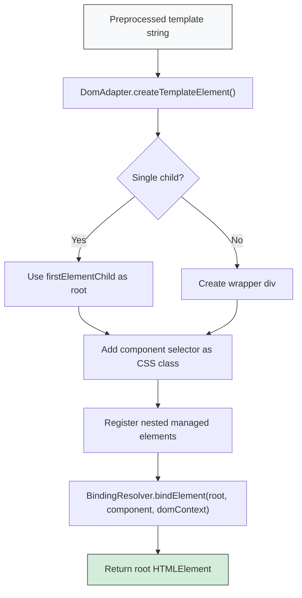

### 4.3. Content projection (native slots)

Pick Components uses Shadow DOM and native `<slot>` elements for content projection. No framework code is involved — the browser handles node assignment natively.

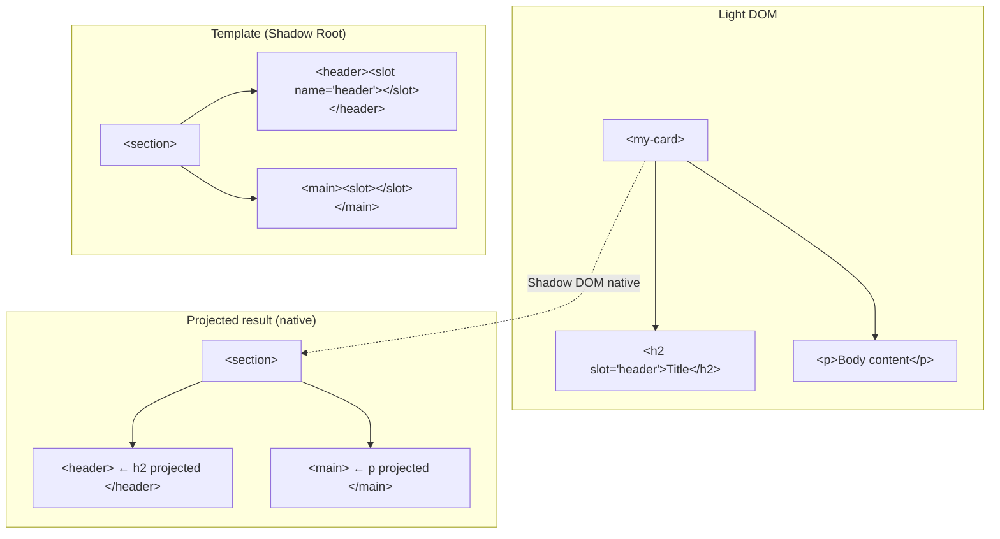

**Projection rules:**

| Slot Type                 | Matching Rule                                | Fallback            |
| ------------------------- | -------------------------------------------- | ------------------- |
| Named (`<slot name="X">`) | Light DOM children with `slot="X"` attribute | `<slot>` inner HTML |
| Default (`<slot>`)        | Light DOM children without `slot` attribute  | `<slot>` inner HTML |

### 4.4. Template Analysis

`TemplateAnalyzer` scans the preprocessed template for `{{expression}}` tokens
using an HTML-aware tokenizer. It only extracts bindings from safe contexts
(text nodes and attribute values), ignoring tag names, attribute names, and
script/style content.

The analysis result is a `CompiledTemplate` containing the template string and
a `Set<string>` of all binding expressions.

---

## 5. Expression Parser

The expression parser is a three-stage pipeline that converts template
expressions like `user.name.toUpperCase()` into evaluated results.

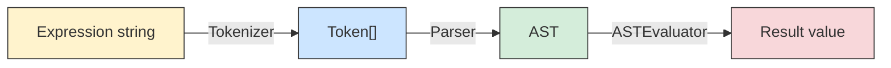

### 5.1. Tokenizer

`Tokenizer` performs lexical analysis — a linear scan that converts an
expression string into a sequence of typed tokens.

**Token types (25):**

| Category    | Tokens                                                         |
| ----------- | -------------------------------------------------------------- |
| Values      | `IDENTIFIER`, `NUMBER`, `STRING`                               |
| Arithmetic  | `PLUS`, `MINUS`, `MULTIPLY`, `DIVIDE`, `MODULO`                |
| Comparison  | `EQUAL` (`===`), `NOT_EQUAL` (`!==`), `GT`, `LT`, `GTE`, `LTE` |
| Logical     | `AND` (`&&`), `OR` (`\|\|`), `NOT` (`!`)                       |
| Access      | `DOT` (`.`), `OPTIONAL_CHAIN` (`?.`)                           |
| Grouping    | `LPAREN`, `RPAREN`, `COMMA`                                    |
| Conditional | `QUESTION` (`?`), `COLON` (`:`)                                |
| Terminus    | `EOF`                                                          |

**Scanning algorithm:**

1. Skip whitespace
2. Check 3-character operators first (`===`, `!==`)
3. Check 2-character operators (`?.`, `>=`, `<=`, `&&`, `||`)
4. Match single-character tokens via switch
5. Read identifiers (`/[a-zA-Z_$][a-zA-Z0-9_$]*/`)
6. Read numbers (`/[0-9.]+/`)
7. Read strings (single or double quotes, with escape sequences)
8. Append `EOF`

**Example:**

```
Input:  "user.name + 'suffix'"
Output: [IDENT(user), DOT, IDENT(name), PLUS, STRING(suffix), EOF]
```

### 5.2. Parser

`Parser` is a recursive descent parser that converts tokens into an
Abstract Syntax Tree (AST). Each grammar rule maps to a method, and operator
precedence is encoded in the call hierarchy.

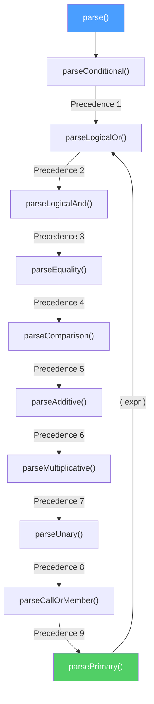

**Operator precedence table (lowest → highest):**

| Level | Method                | Operators                       | Associativity |
| ----- | --------------------- | ------------------------------- | ------------- |
| 1     | `parseConditional`    | `? :`                           | Right         |
| 2     | `parseLogicalOr`      | `\|\|`                          | Left          |
| 3     | `parseLogicalAnd`     | `&&`                            | Left          |
| 4     | `parseEquality`       | `===`, `!==`                    | Left          |
| 5     | `parseComparison`     | `>`, `<`, `>=`, `<=`            | Left          |
| 6     | `parseAdditive`       | `+`, `-`                        | Left          |
| 7     | `parseMultiplicative` | `*`, `/`, `%`                   | Left          |
| 8     | `parseUnary`          | `!`, `-`, `+` (prefix)          | Right         |
| 9     | `parseCallOrMember`   | `.`, `?.`, `()`                 | Left          |
| 10    | `parsePrimary`        | literals, identifiers, `(expr)` | —             |

**Depth protection:** The parser tracks nesting depth across parenthesized
expressions and ternary chains. If depth exceeds `MAX_DEPTH` (32), it throws
`Expression nesting depth exceeds maximum of 32`.

### 5.3. AST Node Types

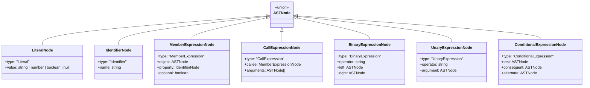

**Parsing example:**

```
Expression: "a + b * 2"

AST:
  BinaryExpression(+)
  ├── Identifier(a)
  └── BinaryExpression(*)
      ├── Identifier(b)
      └── Literal(2)
```

Multiplication binds tighter than addition because `parseAdditive` calls
`parseMultiplicative` first, which fully resolves `b * 2` before returning
to the additive level.

### 5.4. ASTEvaluator (Strategy Pattern)

`ASTEvaluator` dispatches evaluation to node-type-specific strategies.
Each strategy implements `INodeEvaluatorStrategy` and handles one AST
node type.

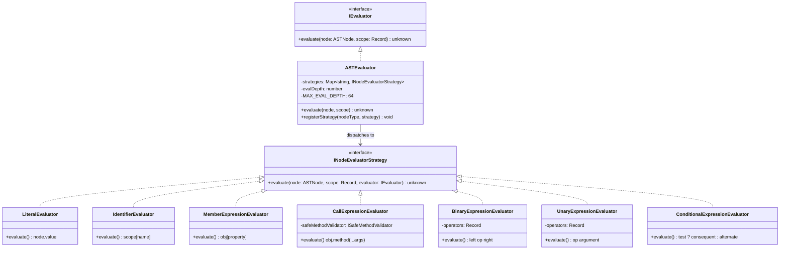

**Evaluation behavior per strategy:**

| Strategy                         | Input                              | Output                                                                                   |
| -------------------------------- | ---------------------------------- | ---------------------------------------------------------------------------------------- |
| `LiteralEvaluator`               | `Literal(42)`                      | `42`                                                                                     |
| `IdentifierEvaluator`            | `Identifier("x")` + scope `{x: 5}` | `5`                                                                                      |
| `MemberExpressionEvaluator`      | `obj.prop`                         | `obj[prop]`, with `?.` support                                                           |
| `CallExpressionEvaluator`        | `str.toUpperCase()`                | Validates against `SafeMethodValidator`, then invokes                                    |
| `BinaryExpressionEvaluator`      | `3 + 4`                            | `7` — supports `+`, `-`, `*`, `/`, `%`, `===`, `!==`, `>`, `<`, `>=`, `<=`, `&&`, `\|\|` |
| `UnaryExpressionEvaluator`       | `!true`                            | `false` — supports `!`, `-`, `+`                                                         |
| `ConditionalExpressionEvaluator` | `x ? a : b`                        | Evaluates `test`, then `consequent` or `alternate` (short-circuit)                       |

**Depth protection:** `ASTEvaluator` tracks evaluation depth. If depth exceeds
`MAX_EVAL_DEPTH` (64), it throws `Expression evaluation depth exceeds maximum of 64`.

### 5.5. ExpressionParserService (Orchestrator)

`ExpressionParserService` coordinates the full pipeline and adds two features:
**caching** and **dependency extraction**.

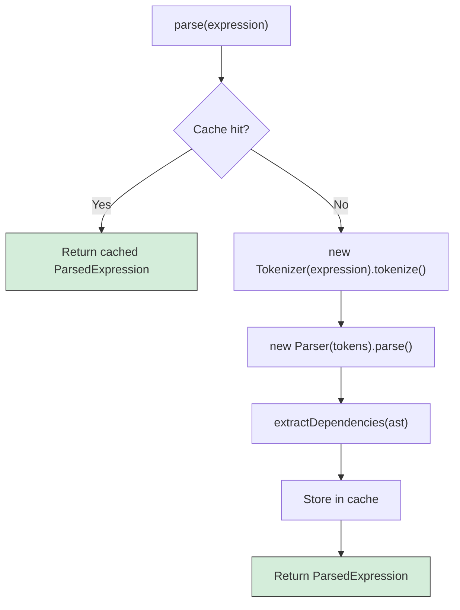

**Dependency extraction** traverses the AST depth-first and collects root
identifiers:

```
Expression: "user.name + getAge(items)"
AST traversal:
  BinaryExpression(+)
  ├── MemberExpression → object is Identifier("user") → add "user"
  └── CallExpression
      ├── callee: Identifier("getAge") → add "getAge"
      └── args[0]: Identifier("items") → add "items"

Dependencies: ["user", "getAge", "items"]
```

### 5.6. Complete Parsing Trace

End-to-end trace for `user.name.toUpperCase() + ' is ' + (age > 18 ? 'adult' : 'minor')`:

```mermaid
flowchart TD
    subgraph "1. Tokenization"
        T1["IDENT(user)"] --> T2["DOT"]
        T2 --> T3["IDENT(name)"]
        T3 --> T4["DOT"]
        T4 --> T5["IDENT(toUpperCase)"]
        T5 --> T6["LPAREN"]
        T6 --> T7["RPAREN"]
        T7 --> T8["PLUS"]
        T8 --> T9["STRING(' is ')"]
        T9 --> T10["PLUS"]
        T10 --> T11["LPAREN"]
        T11 --> T12["IDENT(age)"]
        T12 --> T13["GT"]
        T13 --> T14["NUMBER(18)"]
        T14 --> T15["QUESTION"]
        T15 --> T16["STRING('adult')"]
        T16 --> T17["COLON"]
        T17 --> T18["STRING('minor')"]
        T18 --> T19["RPAREN"]
        T19 --> T20["EOF"]
    end

    subgraph "2. AST"
        AST1["BinaryExpression(+)"]
        AST1 --> AST2["BinaryExpression(+)"]
        AST1 --> AST3["ConditionalExpression"]
        AST2 --> AST4["CallExpression"]
        AST2 --> AST5["Literal(' is ')"]
        AST4 --> AST6["MemberExpression(toUpperCase)"]
        AST6 --> AST7["MemberExpression(name)"]
        AST7 --> AST8["Identifier(user)"]
        AST3 --> AST9["BinaryExpression(>)"]
        AST3 --> AST10["Literal('adult')"]
        AST3 --> AST11["Literal('minor')"]
        AST9 --> AST12["Identifier(age)"]
        AST9 --> AST13["Literal(18)"]
    end

    subgraph "3. Evaluation"
        E1["scope = { user: { name: 'alice' }, age: 25 }"]
        E2["user.name → 'alice'"]
        E3["'alice'.toUpperCase() → 'ALICE' ✓ SafeMethodValidator"]
        E4["'ALICE' + ' is ' → 'ALICE is '"]
        E5["25 > 18 → true"]
        E6["true ? 'adult' : 'minor' → 'adult'"]
        E7["'ALICE is ' + 'adult' → 'ALICE is adult'"]
    end
```

---

## 6. Binding Resolution

### 6.1. BindingResolver

`BindingResolver` is the bridge between the compiled DOM and the reactivity
system. It walks the DOM tree, identifies `{{expression}}` tokens in
attribute values and text nodes, extracts property dependencies, and
subscribes to reactive observables.

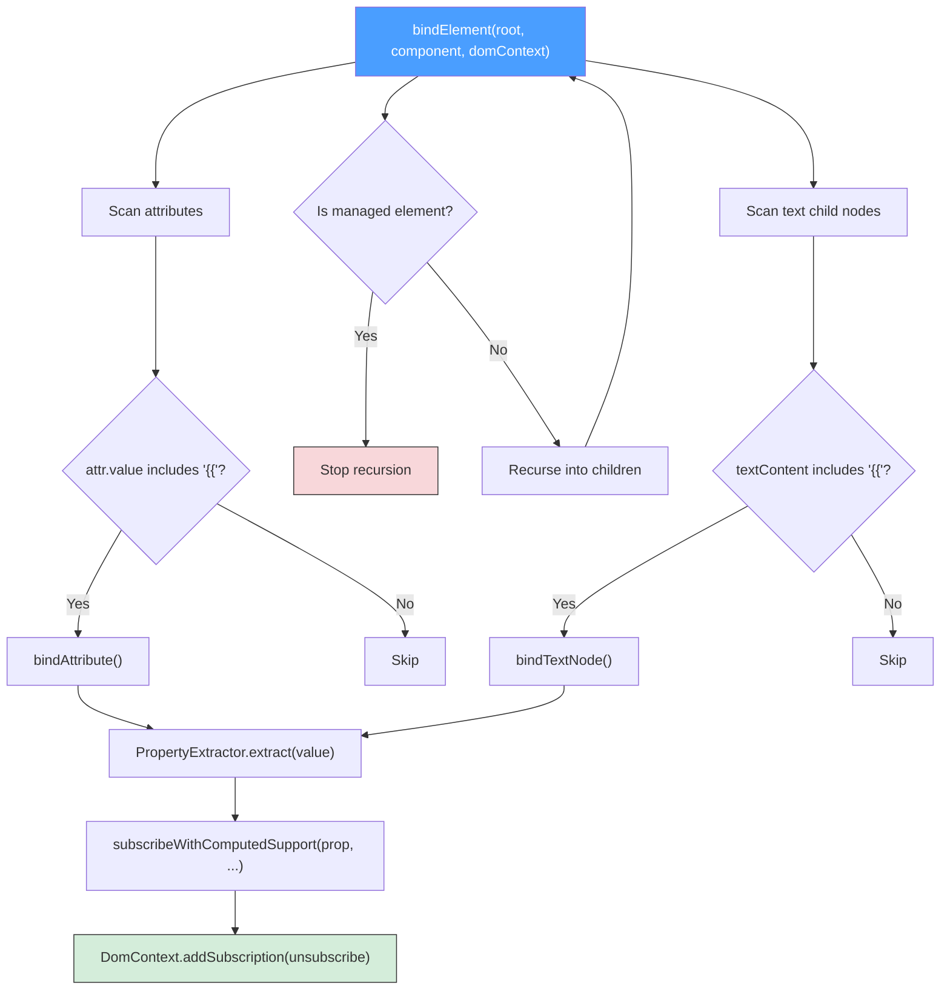

### 6.2. Attribute Binding

For each attribute containing `{{...}}`:

1. **Extract dependencies** via `PropertyExtractor`
2. **Create update callback** that re-evaluates the expression and sets the
   attribute value
3. **Execute immediately** to set the initial value
4. **Subscribe** to each dependency's observable

**Object binding optimization:** If the binding is a simple `{{prop}}` pointing
to an object or array, the value is stored in `ObjectRegistry` and the attribute
receives a reference ID instead of `[object Object]`.

### 6.3. Text Node Binding

Same pattern as attributes, but updates `node.textContent` instead of
`attr.value`.

### 6.4. Computed Getter Support

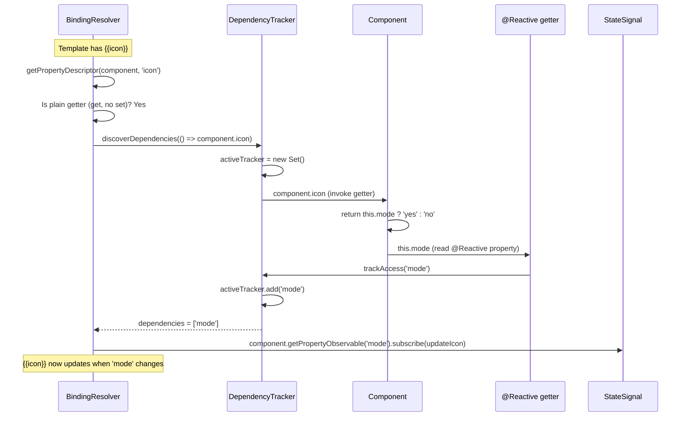

This mechanism enables computed getters to participate in reactivity without
requiring explicit dependency declarations. The `@Reactive` decorator's getter
interceptor calls `DependencyTracker.trackAccess()`, which records the property
access only when a tracking context is active.

---

## 7. Reactivity System

### 7.1. Architecture

The reactivity system is signal-based with per-property granularity. There are
no deep proxies or virtual DOM diffs — each `@Reactive` property has its own
`StateSignal` channel, and only subscribers to that specific property are
notified on change.

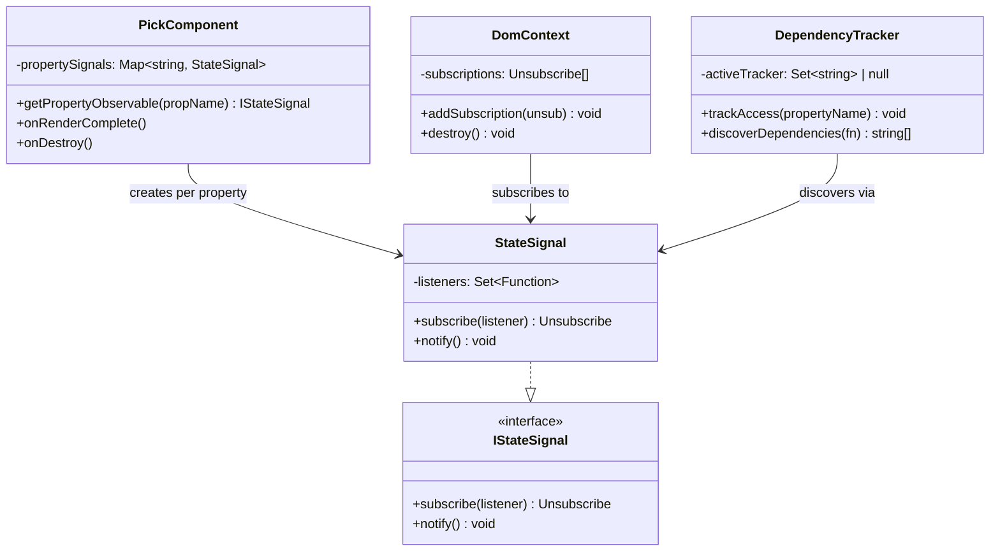

### 7.2. Reactive Update Cycle

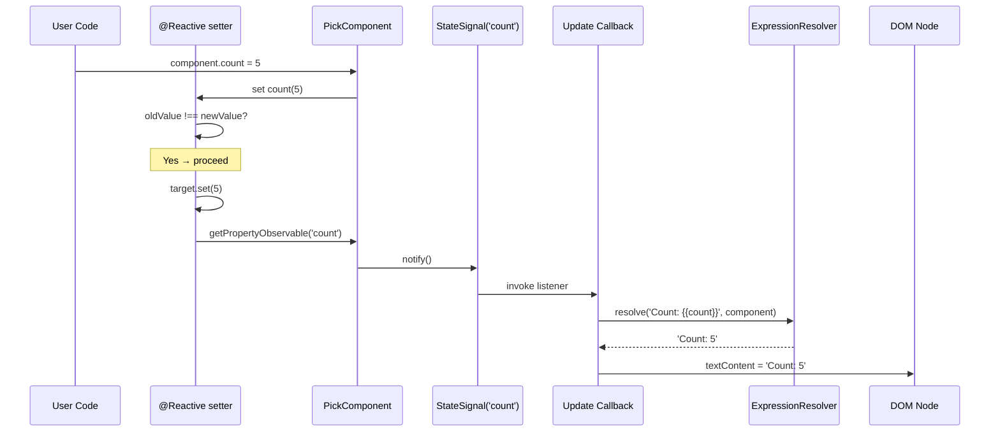

### 7.3. @Reactive Decorator Internals

The `@Reactive` decorator supports TypeScript 5.0+ standard decorator syntax
and the `experimentalDecorators` pipeline:

Tooling requirement:

- Accepted emit: TC39 standard decorators or `experimentalDecorators`.
- Preferred state syntax: `@Reactive count = 0`.
- Optional syntax: `@Reactive accessor count = 0` remains supported for TC39 auto-accessor users.
- Default framework mode: `bootstrapFramework(Services)` accepts both decorator systems.
- Strict opt-in: `bootstrapFramework(Services, {}, { decorators: "strict" })` rejects `experimentalDecorators` calls.

The playground and downloaded examples both transpile with
`experimentalDecorators: false`, but consumer projects do not need to mirror
that compiler setting. If an external Vite/TypeScript project already uses
`experimentalDecorators`, the default `auto` mode keeps `@Reactive count = 0` working
without requiring a TS config change.

**Getter intercept:**

1. Call `DependencyTracker.trackAccess(propertyName)` — records the access
   if a computed getter discovery is in progress (no-op otherwise)
2. Return the backing value via `target.get.call(this)`

**Setter intercept:**

1. Read old value via `target.get.call(this)`
2. If `oldValue !== newValue`:
   - Store new value via `target.set.call(this, value)`
   - Call `this.getPropertyObservable(propertyName).notify()` — triggers
     all subscribed DOM update callbacks

### 7.4. StateSignal

Minimal observable implementation:

- `subscribe(listener)` — adds function to a `Set`, returns an unsubscribe
  function that removes it
- `notify()` — iterates a snapshot copy of listeners, calling each one.
  Exceptions are isolated per listener so one faulty subscriber does not
  break the notification chain.

### 7.5. Subscription Lifecycle

All subscriptions created during binding are stored in `DomContext` via
`addSubscription(unsubscribe)`. When `DomContext.destroy()` is called:

1. All unsubscribe functions execute (listeners removed from `StateSignal`)
2. DOM element is removed from parent
3. Context is released from `ComponentInstanceRegistry`

This guarantees zero subscription leaks.

---

## 8. Security Model

### 8.1. Safe Method Whitelist

`CallExpressionEvaluator` validates every method call against
`SafeMethodValidator` before invocation. Only explicitly whitelisted methods
are allowed.

| Type     | Allowed Methods                                                                                                                                                                                                                                             |
| -------- | ----------------------------------------------------------------------------------------------------------------------------------------------------------------------------------------------------------------------------------------------------------- |
| `string` | `charAt`, `charCodeAt`, `concat`, `endsWith`, `includes`, `indexOf`, `lastIndexOf`, `match`, `padEnd`, `padStart`, `repeat`, `replace`, `search`, `slice`, `split`, `startsWith`, `substring`, `toLowerCase`, `toUpperCase`, `trim`, `trimEnd`, `trimStart` |
| `number` | `toExponential`, `toFixed`, `toLocaleString`, `toPrecision`, `toString`, `valueOf`                                                                                                                                                                          |
| `Array`  | `join`, `concat`, `slice`, `indexOf`, `lastIndexOf`, `includes`, `toString`, `toLocaleString`                                                                                                                                                               |
| `Date`   | `getDate`, `getDay`, `getFullYear`, `getHours`, `getMilliseconds`, `getMinutes`, `getMonth`, `getSeconds`, `getTime`, `toDateString`, `toISOString`, `toJSON`, `toLocaleDateString`, `toLocaleString`, `toLocaleTimeString`, `toString`, `toTimeString`     |
| `object` | `toString`, `valueOf`                                                                                                                                                                                                                                       |

All whitelisted methods are **read-only** — no mutating methods like `push`,
`splice`, `setDate`, etc.

### 8.2. Recursion Depth Limits

| Component                                  | Limit | Error                                               |
| ------------------------------------------ | ----- | --------------------------------------------------- |
| `Parser` (parseConditional + parsePrimary) | 32    | `Expression nesting depth exceeds maximum of 32`    |
| `ASTEvaluator` (evaluate)                  | 64    | `Expression evaluation depth exceeds maximum of 64` |

The evaluator limit is higher than the parser limit because member chains
like `a.b.c.d.e` create nested `MemberExpression` nodes that each recurse
during evaluation, even though they don't increase parser nesting depth.

### 8.3. Design Decisions

- **No `eval` / `new Function`** — The entire pipeline is deterministic:
  tokenization → parsing → AST → strategy dispatch. No dynamic code generation.
- **Strict equality only** — The parser supports `===` and `!==` but not `==`
  or `!=`, preventing type coercion surprises.
- **HTML-aware template scanning** — `TemplateAnalyzer` uses a self-contained
  HTML fragment scanner to extract bindings only from safe contexts (text and
  attribute values), never from tag names or event handler attributes.

---

## 9. Component Lifecycle

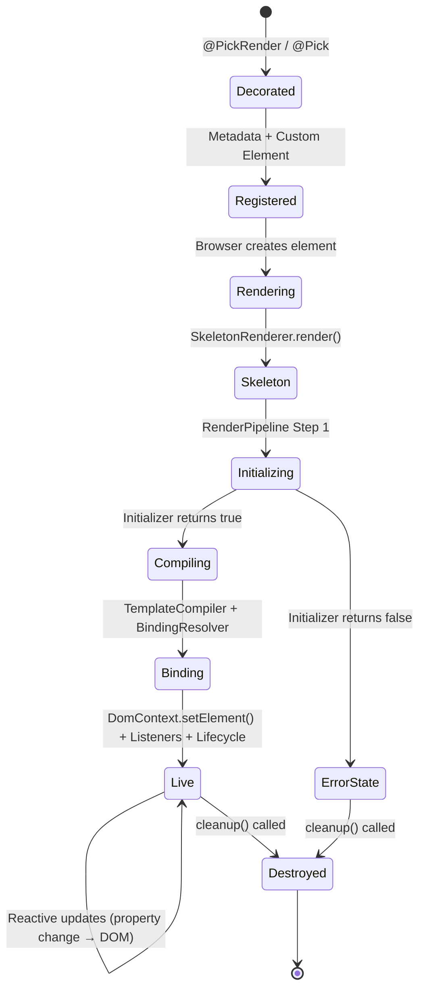

### Lifecycle Hooks

| Phase       | Who                         | Method                          | Purpose                                   |
| ----------- | --------------------------- | ------------------------------- | ----------------------------------------- |
| Pre-render  | `PickInitializer` | `onInitialize(component)`       | Async setup (fetch data, configure state) |
| Post-render | `PickComponent`            | `onRenderComplete()`            | DOM available, can query elements         |
| Post-render | `PickLifecycleManager`     | `onComponentReady(component)`   | Wire subscriptions to services, event bus |
| Destroy     | `PickLifecycleManager`     | `onComponentDestroy(component)` | Cleanup business logic                    |
| Destroy     | `PickComponent`            | `onDestroy()`                   | Emits `destroyed$` signal                 |
| Destroy     | `DomContext`                | `destroy()`                     | Run all unsubscribes, remove DOM          |

### LifecycleManager Subscription Pattern

`PickLifecycleManager.addSubscription()` registers teardown functions that
run automatically when `stopListening()` is called. This prevents subscription
leaks in business logic:

```typescript
protected onComponentReady(component: MyComponent): void {
  // Subscribe to service → update component state
  this.addSubscription(
    dataService.onUpdate$.subscribe(data => {
      component.items = data;  // @Reactive triggers DOM update
    })
  );
}
```

---

## Design Patterns Summary

| Pattern   | Where                                                                              | Purpose                                           |
| --------- | ---------------------------------------------------------------------------------- | ------------------------------------------------- |
| Strategy  | `ASTEvaluator` → `INodeEvaluatorStrategy`                                          | Extensible evaluation without modifying evaluator |
| Observer  | `StateSignal` → subscriber callbacks                                               | Reactive property change notifications            |
| Factory   | `initializer: () => new Init(deps)`                                                | Explicit DI for lifecycle collaborators           |
| Pipeline  | `RenderPipeline` 7-step sequence                                                   | Ordered, composable rendering phases              |
| Registry  | `ComponentMetadataRegistry`, `ComponentInstanceRegistry`, `ManagedElementRegistry` | Decoupled lookup and lifecycle management         |
| Composite | `DomContext.subscriptions[]`                                                       | Central cleanup for all subscription teardowns    |
| Facade    | `RenderEngine`                                                                     | Single entry point hiding rendering complexity    |
| Decorator | `@Reactive`, `@PickRender`, `@Pick`, `@Listen`                                   | Declarative metadata and behavior attachment      |
| WeakMap   | `ManagedElementRegistry`                                                           | GC-friendly element/instance associations         |
